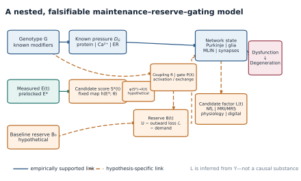
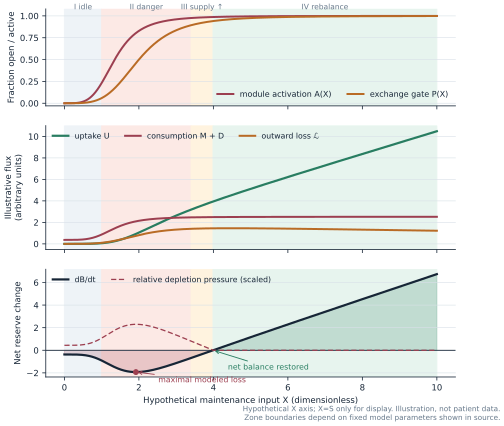
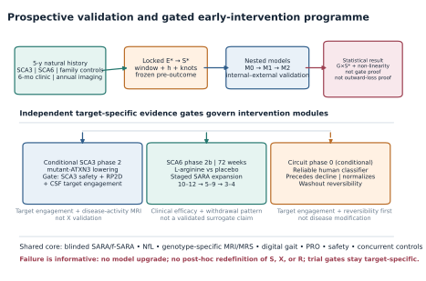

# Maintenance–Reserve–Gating Framework for Hereditary Cerebellar Ataxia

[](#scientific-status)
[](LICENSE)
[](submission/the-cerebellum/submission-checklist.md)
[](evidence/evidence-audit.md)

A public, submission-oriented new-ideas/in-depth-review package for testing whether modifier effects in hereditary cerebellar ataxia can include a mismatch between genetic demand, externally conditioned system activation, and finite homeostatic reserve. Version 0.2.1 is the author-confirmed v0.2 submission candidate tailored for a presubmission inquiry to *The Cerebellum*; it has not been submitted, peer reviewed, or accepted.

The central discipline of this repository is simple: **the derived exposure score $S$ is not the unknown biological input $X$; $X$, the gate, outward leak, reserve state, and hump-shaped human risk curve are hypotheses—not discoveries.** The package turns them into prespecified predictions that can fail, while keeping clinical intervention focused on known, measurable biology.

- [English manuscript](manuscript/manuscript.md)
- [中文工作稿](manuscript/manuscript_zh.md)
- [Prospective SCA3/SCA6 cohort](protocols/prospective-cohort.md)
- [Early-intervention trial concepts](protocols/early-intervention-trial.md)
- [Statistical analysis plan](protocols/statistical-analysis-plan.md)
- [Evidence audit](evidence/evidence-audit.md)
- [Evidence matrix](evidence/evidence-matrix.tsv)
- [Draft presubmission inquiry](submission/the-cerebellum/presubmission-inquiry.md)
- [The Cerebellum submission checklist](submission/the-cerebellum/submission-checklist.md)

## The three figures

### 1. Nested causal architecture



Solid links are empirically supported in at least one cited system; dashed links are hypothesis-specific. The $\phi:S\rightarrow X$ bridge is hypothetical, and $L(t)$ is a candidate biomarker factor rather than a second causal substance.

### 2. Low-input idle → intermediate danger → high-input rebalance



The horizontal axis is hypothetical $X$, with $X=S$ used only as an illustrative convention. This is a deterministic example under one dimensionless parameter set—not patient data, a fitted dose–response, or a dosing recommendation.

### 3. Prospective test-and-intervene programme



The shared natural-history core leads to separate SCA3 and SCA6 trials. The circuit module remains inactive until a reliable human classifier demonstrates temporal precedence and washout reversibility.

## Scientific status

This is a research hypothesis and protocol concept, not a peer-reviewed mechanism, registered clinical trial, clinical guideline, or treatment recommendation.

| Claim level | What this repository says |
|---|---|
| Established | SCA onset and progression vary beyond the causal repeat; structural and functional cerebellar reserve are established concepts; early biomarkers, multicellular effects, and stage-dependent reversibility occur in specific cohorts or models. |
| Supported analogy | Resilience, network state, and restoration of a defined missing synaptic input can matter in cerebellar biology. |
| Testable inference | One prelocked measured exposure may show a non-monotonic association and genotype interaction that precedes biomarker change. |
| Mechanistic extension | A candidate external input, activation/exchange gate, and dynamic reserve flux generate ordered mediator predictions. These entities are not observed facts. |

The [claim-level audit](evidence/evidence-audit.md) documents the model system, population, limitation, DOI or primary source, and corrected wording for every major statement.

## Prospective programme at a glance

The observational core is a five-year, multicentre, family-aware SCA3/SCA6 cohort. SCA3 is the primary test bed; SCA6 is a transport and heterogeneity test, not automatic pooled confirmation. Phenoconversion is analysed with age as the time scale, delayed entry, interval censoring, and family/site structure. One measured exposure operationalization $E^*$ is selected from a finite two-candidate shortlist by a registered outcome-blind rubric; its derived score $S^*=h(E^*;\theta)$, lag, spatial rule, spline knots, and missing-data rules are then frozen before outcome analysis. The pesticide and untreated-well candidates are rural-environment proxies, not maintenance resources or direct measurements of $X$. Even a replicated hump and genotype interaction would support only a non-linear environmental association, not a gate or leak. Residual age at onset is descriptive, not the primary estimand.

The event-driven planning scenarios are intentionally transparent:

- About 108 conversions for a simplified linear exposure effect (HR 1.5 per SD, 90% power, two-sided α 0.025, covariate $R^2=0.30$).
- An 800-carrier scenario (500 SCA3 + 300 SCA6) yields about 132 observed five-year conversions under stated assumptions—potentially adequate for an SCA3-led exposure estimate if exposure support is favourable, but not a flexible genotype interaction.
- Recruitment ratios do not define biological or target-population weights. Final sizing and any interaction claim require frozen simulation of genotype-specific support, interval censoring, family clustering, exposure error, and site heterogeneity.

There is no pooled SCA3/SCA6 pharmacologic efficacy trial:

- **SCA3:** conditional, target-engagement-led mutant-ATXN3 lowering only after agent-specific human safety and dose information; clinical benefit is not established.
- **SCA6:** L-arginine remains clinically uncertain; a confirmatory study would require conservative effect assumptions, concurrent randomized controls, staged entry into earlier disease, and enhanced safety monitoring.
- **Circuit phase 0:** no activation until four reliability, temporal-precedence, normalization, and washout gates are met.

These trials test early modifiability of known targets. They do not validate $X$.

## Reproduce the package

Python 3.11+ can resolve the compatible ranges in [requirements.txt](requirements.txt). For an exact reproduction of the validated release environment, use Python 3.14.6 and install [requirements-lock.txt](requirements-lock.txt); its current NumPy and SciPy pins require Python 3.12 or newer.

```bash
python3 -m venv .venv
.venv/bin/python -m pip install -r requirements-lock.txt
.venv/bin/python figures/src/make_figures.py
.venv/bin/python analysis/sample_size_scenarios.py
.venv/bin/python -m unittest discover -s tests -v
.venv/bin/python scripts/validate_repository.py
```

Expected generated outputs:

- three editable SVG figures;
- three journal-ready PDF figures;
- three 600-dpi PNG figures;
- one deterministic sample-size scenario table.

All numerical assumptions are visible in source. The scripts do not download participant data or make network requests.

## Repository map

```text
manuscript/   English and Chinese manuscripts; BibTeX bibliography
protocols/    prospective cohort, early-intervention concepts, and SAP
evidence/     narrative audit and tab-separated claim matrix
figures/      editable source plus SVG/PDF/600-dpi PNG outputs
analysis/     transparent sample-size functions and scenario CSV
scripts/      repository-level integrity and safety checks
tests/        unit tests for equations, scenarios, figures, and validation
docs/         design and implementation provenance
submission/   presubmission inquiry and journal-specific completion checklist
```

## Contact

For scholarly collaboration, corrections, media enquiries, or commercial-licensing requests, email [278404704@qq.com](mailto:278404704@qq.com). Please use public Issues only for non-sensitive questions and corrections; do not post participant-level, genetic, address, or medical information.

## Safety and ethics

There is no evidence identifying an unknown $X$, its dose, delivery route, or safety profile. No one should use unvalidated electromagnetic fields, radiation, supplements, drugs, neural injury, or gene manipulation on the basis of this repository. Protocol implementation requires a sponsor, product-specific toxicology and manufacturing information, regulatory authorization, ethics approval, trial registration, independent monitoring, qualified sites, and informed consent.

Residential histories and genetic-carrier data are sensitive. Any real cohort must use privacy-preserving geocoding, genetic counselling, community-sensitive communication, and a prespecified governance plan.

## Versioning, citation, and license

The evidence cut-off for version 0.2.1 is **19 August 2026**. Current trial status is timestamped rather than assumed to remain current. Version history is recorded in [CHANGELOG.md](CHANGELOG.md).

Please cite using [CITATION.cff](CITATION.cff). Text, protocols, original figures, and code are released under [CC BY-NC 4.0](LICENSE): personal use and non-commercial research, teaching, sharing, and adaptation are permitted with attribution; commercial use requires separate permission from the copyright holder. Third-party papers and linked materials retain their original copyright.

Because the NonCommercial condition restricts fields of use, this is a **public, non-commercially licensed/source-available repository**, not “open source” under the Open Source Initiative definition.

## Contributing

Corrections are welcome when they include a primary-source link and identify the exact claim affected. Proposed model changes should state in advance what observation would make them fail. Do not open an issue containing participant-level, genetic, address, medical, or other sensitive data.
